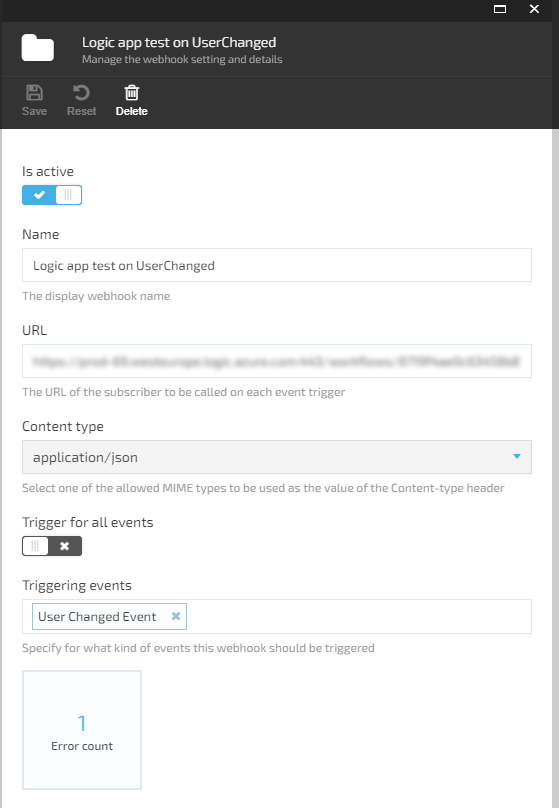
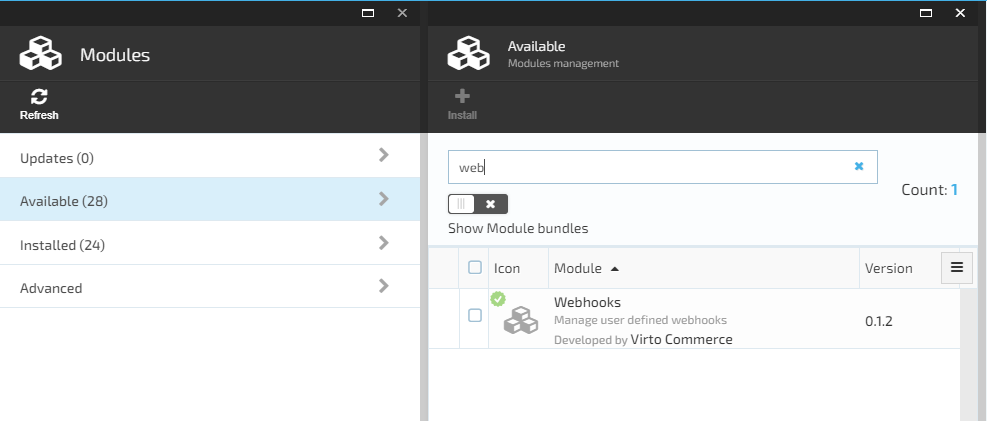

    

# Overview

The webhooks module allows to register and send webhook notifications for any event available in the system.

## Key Features

1. Sending Webhook notifications in the background via a POST request with JSON serialized event data to the specified URL;  
1. Managing the list of webhooks;  

1. Viewing or updating Webhook details;

1. Using `DomainEvent` descendant to trigger webhook notification;  
1. Sending retry policy with configurable exponential intervals;  

1. Viewing the list of errors for the webhook failed notifications;  

## Installation

You can find the module in the list of VirtoCommerce available modules.  

## Documentation

[Webhooks Document](/docs/index.md)

[View on Github](https://github.com/VirtoCommerce/vc-module-webhooks/tree/dev)

## References

1. Deploy: https://virtocommerce.com/docs/latest/developer-guide/deploy-module-from-source-code/

1. Installation: https://www.virtocommerce.com/docs/latest/user-guide/modules/

1. Home: https://virtocommerce.com

1. Community: https://www.virtocommerce.org

1. [Download Latest Release](https://github.com/VirtoCommerce/vc-module-webhooks/releases/)

## License

Copyright (c) Virto Solutions LTD. All rights reserved.

Licensed under the Virto Commerce Open Software License (the "License"); you may not use this file except in compliance with the License. You may obtain a copy of the License at

http://virtocommerce.com/opensourcelicense

Unless required by applicable law or agreed to in writing, software distributed under the License is distributed on an "AS IS" BASIS, WITHOUT WARRANTIES OR CONDITIONS OF ANY KIND, either express or implied.
