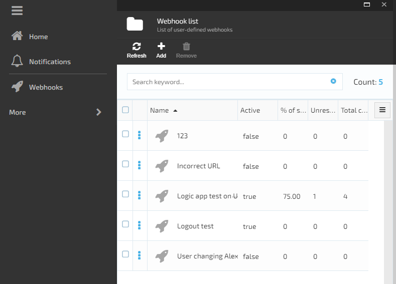
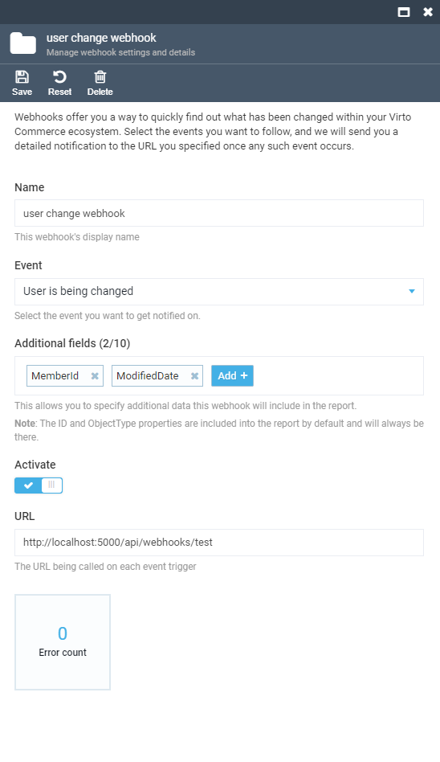
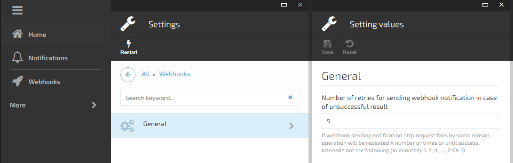
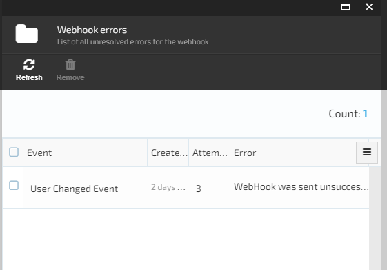

# Virto Commerce Webhook Module

    

The webhooks module allows to register and send webhook notifications for any event available in the system.

## Key Features

1. Sending Webhook notifications in the background via a POST request with JSON serialized event data to the specified URL;
1. Auth Support: Basic & Bearer.
1. Managing the list of webhooks;

1. Viewing or updating Webhook details;

1. Using `DomainEvent` descendant to trigger webhook notification;
1. Access to previous values of selected fields;
1. Sending retry policy with configurable exponential intervals;

1. Viewing the list of errors for the webhook failed notifications;

## Documentation

* [Module Documentation](https://virtocommerce.com/docs/latest/modules/webhooks/)
* [View on GitHub](docs/index.md)

## References

* Deployment: https://virtocommerce.com/docs/latest/developer-guide/deploy-module-from-source-code/
* Installation: https://www.virtocommerce.com/docs/latest/user-guide/modules/
* Home: https://virtocommerce.com
* Community: https://www.virtocommerce.org
* [Download Latest Release](https://github.com/VirtoCommerce/vc-module-webhooks/releases/latest)

## License

Copyright (c) Virto Solutions LTD.  All rights reserved.

This software is licensed under the Virto Commerce Open Software License (the "License"); you
may not use this file except in compliance with the License. You may
obtain a copy of the License at http://virtocommerce.com/opensourcelicense.

Unless required by the applicable law or agreed to in written form, the software
distributed under the License is provided on an "AS IS" BASIS,
WITHOUT WARRANTIES OR CONDITIONS OF ANY KIND, either express or
implied.
