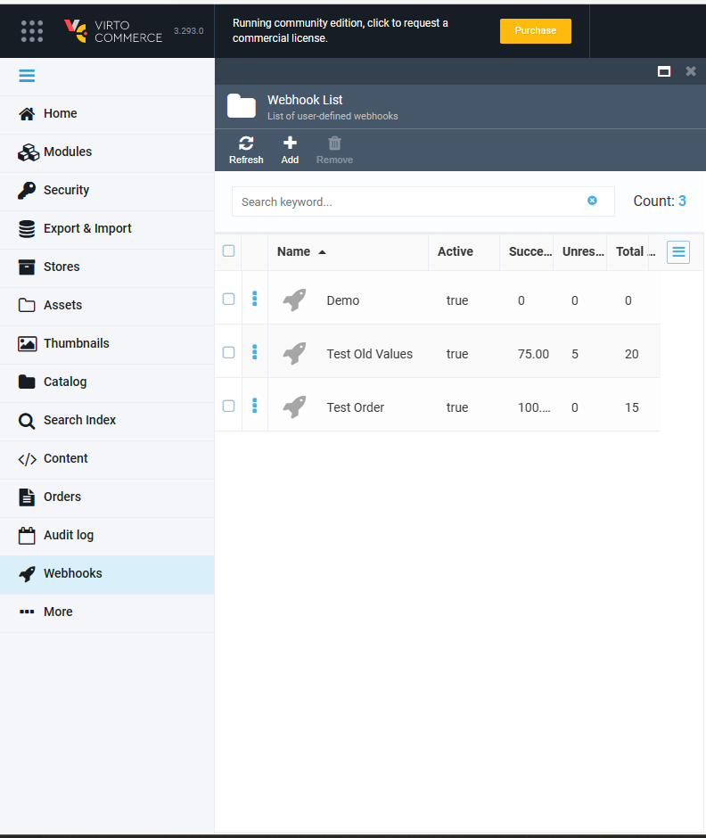
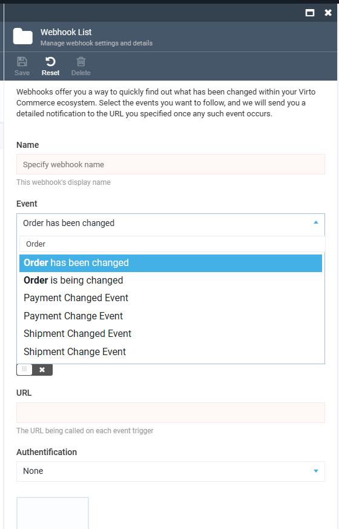
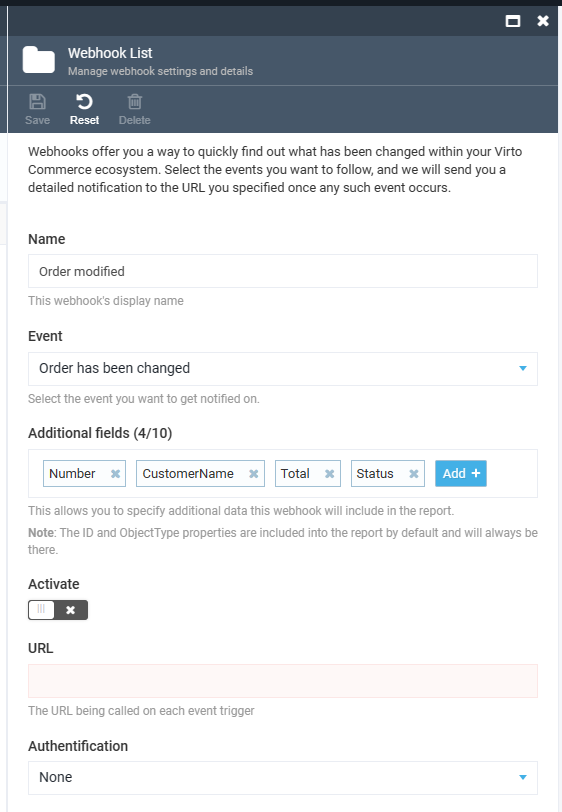
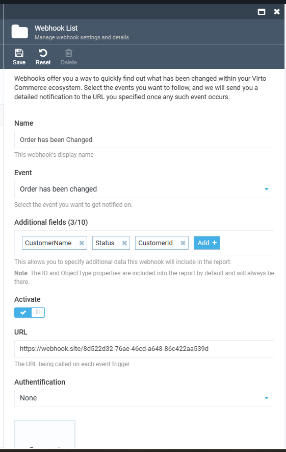
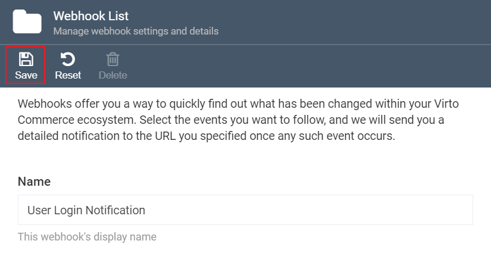
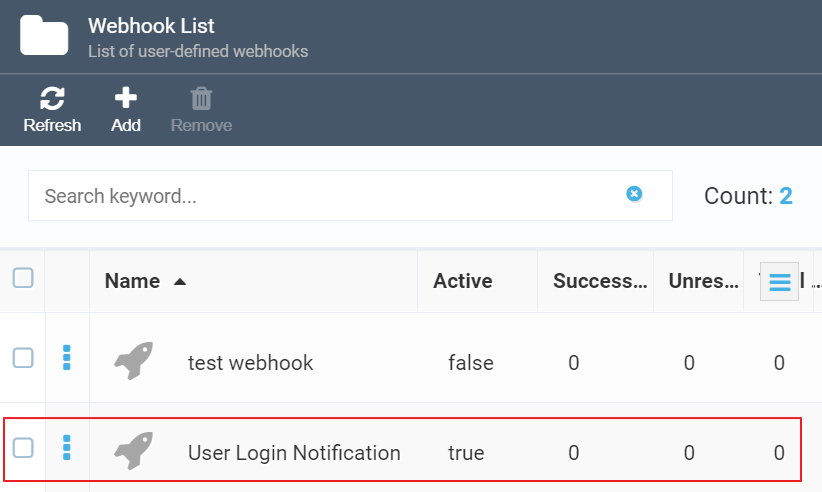
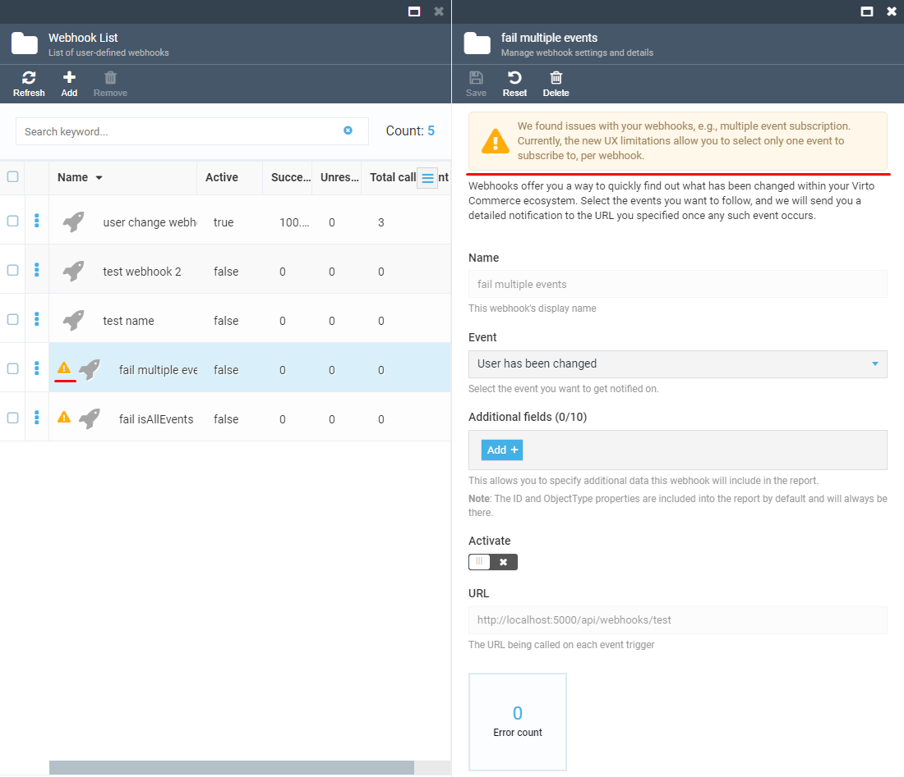

# Overview

The Webhooks module allows you to monitor important changes within your Virto Commerce ecosystem,
such as order changes, catalog and product updates, and more.
When a change you're subscribed to is triggered, you'll receive a notification at the URL you specified.
You can also configure which fields or parameters to include in the report you receive.

## Key Features

1. Employees can manage webhooks under their own permission level
1. Admin users can manage webhooks
1. Resolves Virto Commerce Domain Events for installed modules
1. Sends webhook notifications in the background via a POST request with JSON serialized event data to the specified URL
1. Supports Basic & Bearer Token authentication
1. Access to previous values of selected fields
1. Configurable retry policy with exponential intervals
1. View error messages when a webhook notification fails

## Configuraton

To create a new webhook, go to the Webhooks module and click Add.
Give your webhook a name and select the event you want to monitor.
You can select up to ten additional parameters to include in the notification you receive.
Toggle the Activate button and enter the URL to receive the report.
Save your webhook, and you'll be able to see it in the list.



This will open the *Webhook List* tab:


Give your webhook a name and select the event you want to follow; for instance, you may want to get notified when a user profile has been changed, a user has logged in or out, or has reset their password:



***Please note:*** *You can only select **one** event per webhook. This means that, if you want to track, say, both the **User Logged In** and **User Logged Out** events, you will have to create two different webhooks. You can, however, create any reasonable number of webhooks you need.*

In the *Additional Fields* area, you can select up to ten additional parameters you will see in the notification you will get with this webhook:



By default, only the *ID* and *ObjectType* properties will be included into the report. If you do not want any additional parameters to appear, just skip this step.

Finally, toggle the *Activate* button to get your webhook running or leave it deactivated if you want to enable it later, and specify the URL you will get the report at:



This is it. You can now click the *Save* button in the upper part of the tab to finalize your webhook configuration:



Once you do so, you will be able to see your new webhook in the list:



Alternatively, you can click the *Reset* button to reconfigure your webhook from scratch.

## Auth Support: Basic & Bearer
 It allows to specify authentication credentials for webhooks using either Basic or Bearer Token authentication.
 The feature adds the necessary authentication headers to the webhook requests to authenticate the user and allow access to the webhook endpoint.
 This enhances the security and flexibility of the webhook integration by supporting multiple authentication mechanisms,
 which can be selected based on the specific requirements of the webhook endpoint.

## Warning Message
If you use webhooks with multiple event subscriptions in the previous version, you might get the following warning message once you update the Virto platform:



This is actually fine: you can continue using such a webhook as you did before, although **you will not be able to edit it**. However, we recommend you remove such webhooks and replace them with new ones instead. Currently, the *single event per webhook* limitation works for the newly created webhooks only, but, moving forward, we might totally remove the code that supports multiple event subscriptions.

## Webhook Json Format
A JSON output for a webhook based on the Order Changed event might look like this:

<details><summary>Please expand this paragraph to see an example of JSON output for a webhook based on the Order Changed event.</summary>

```
{
  "EventId": "VirtoCommerce.OrdersModule.Core.Events.OrderChangedEvent",
  "Attempt": 1,
  "EventBody": [
    {
      "ObjectType": "VirtoCommerce.OrdersModule.Core.Model.CustomerOrder",
      "Id": "1d58ff39-0631-44aa-afc6-a0d4adbc9787",
      "Status": "New",
      "Number": "CO220224-00003",
      "__Previous": {
        "Status": "Pending",
        "Number": "CO220224-00003"
      }
    }
  ]
}


NOTE: You can then call the Order API and get the extended order information.

NOTE: `__Previous` field contains the same list of the fields with previous values.

```
</details>

## References
* We recommend using [webhook.site](https://webhook.site/) to inspect and test web hooks.
