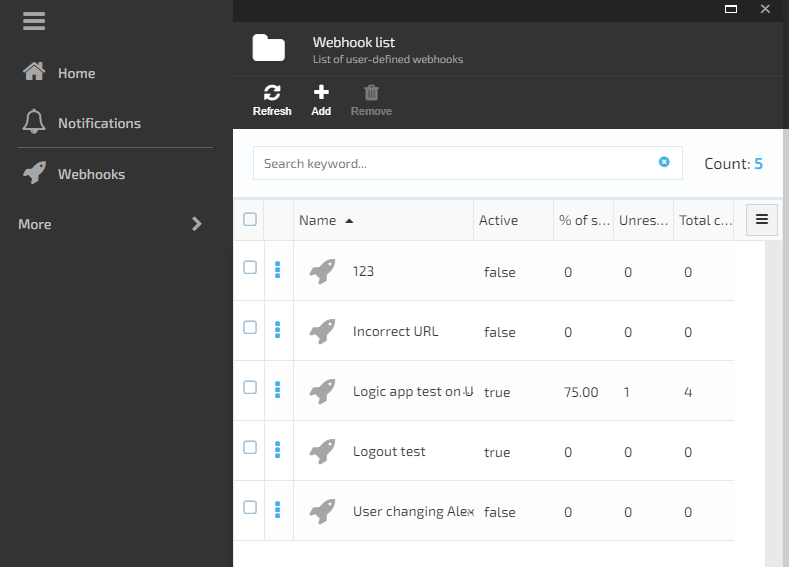
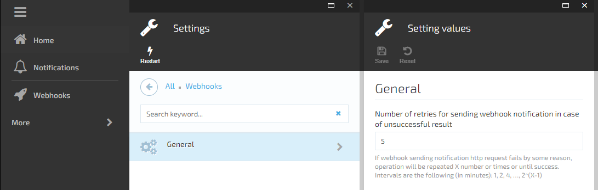

# Overview

The webhooks module allows to register and send webhook notifications for any event available in the system.

## Key Features

1. Sending Webhook notifications in the background via a POST request with JSON serialized event data to the specified URL;  
1. Managing the list of webhooks  

1. Viewing or updating Webhook details;

1. Using `DomainEvent` descendant to trigger webhook notification;  
1. Sending retry policy with configurable exponential intervals  

1. Viewing the list of errors for the webhook failed notifications  


## Installation

You can find the module in the list of VirtoCommerce available modules.  


## How to configure

To create a webhook, you need to "Add" button in the webhook list, and fill in the following details:
- Name;
- URL to send the notification (e.g. the one from Azure LogicApp HttpResponse);
- Content type;
- The list of events you want this webhook be triggered for, or "Trigger all events" for any event;
Turn on "Is active" to make the webhook active, and Save. 
Now the webhook will trigger notification sending for the events you chose.

## Sample of Event JSON

<details><summary>Example of notification, sent on Create or Change order</summary>

```
{
  "EventId": "VirtoCommerce.OrdersModule.Core.Events.OrderChangedEvent",
  "Attempt": 1,
  "EventBody": "[{\"objectId\":\"1780d797-0990-419b-9937-f1d5a7d7b383\",\"objectType\":\"VirtoCommerce.OrdersModule.Core.Model.CustomerOrder\"}]"
}
    
NOTE: Then you can send request to the order API and get the order by ID: REST /api/order/customerOrders/{id}
```
</details>
