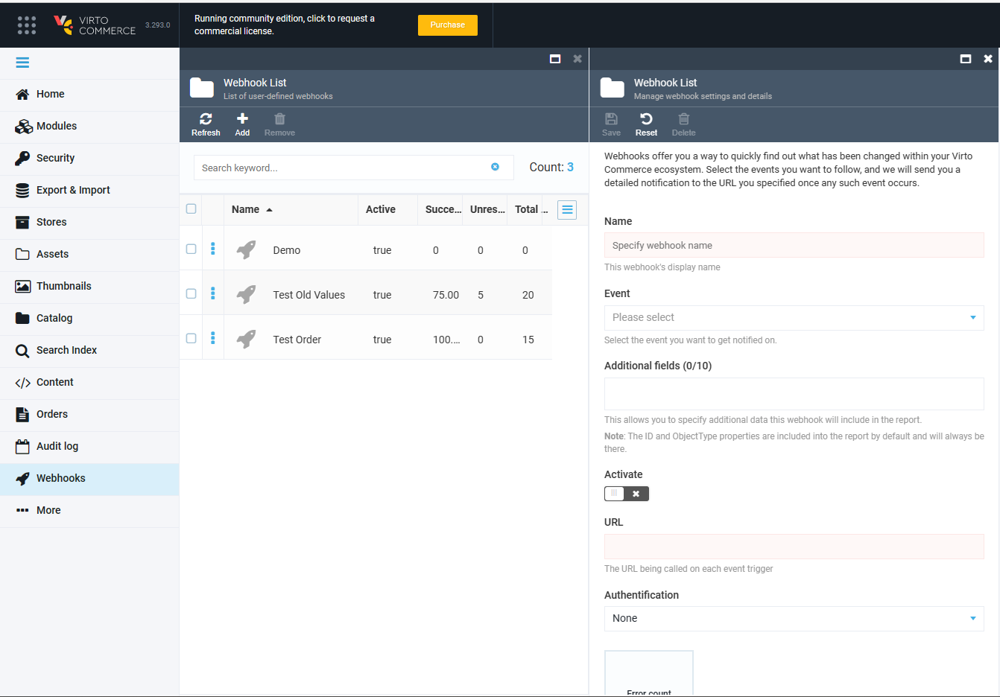

# Webhooks Module

## What Is Webhooks Module?

Simply put, the Webhooks module enables viewing all major changes within your Virto Commerce ecosystem. For instance, you can get notified on user login and/or password changes, catalog or product changes, and so on, which will assist you in better monitoring your system. Whenever a change you are watching (i.e. you 'subscribed to') is triggered, you will get the relevant notification uploaded to the URL address you previously specified. Apart from the event you are following, you can also configure which fields or parameters you will see in the report you get.

## Key Features

Using the Webhooks module basically enables you to do the following:
1. Sending Webhook notifications in the background via a POST request with JSON serialized event data to the specified URL
1. Managing webhooks
1. Viewing or updating Webhook details
1. Using `DomainEvent` descendant to trigger webhook notifications 
1. Sending the retry policy with configurable exponential intervals  
1. Viewing the error(s) when a webhook notification fails  

## Configuring Webhooks

To configure a new webhook, open the *Webhooks* module and click the *Add* button:


This will open the *Webhook List* tab:



Give your webhook a name and select the event you want to follow; for instance, you may want to get notified when a user profile has been changed, a user has logged in or out, or has reset their password:


***Please note:*** *You can only select **one** event per webhook. This means that, if you want to track, say, both the **User Logged In** and **User Logged Out** events, you will have to create two different webhooks. You can, however, create any reasonable number of webhooks you need.*

In the *Additional Fields* area, you can select up to ten additional parameters you will see in the notification you will get with this webhook:


By default, only the *ID* and *ObjectType* properties will be included into the report. If you do not want any additional parameters to appear, just skip this step.

Finally, toggle the *Activate* button to get your webhook running or leave it deactivated if you want to enable it later, and specify the URL you will get the report at:


This is it. You can now click the *Save* button in the upper part of the tab to finalize your webhook configuration:


Once you do so, you will be able to see your new webhook in the list:


Alternatively, you can click the *Reset* button to reconfigure your webhook from scratch. 

## Example of Output JSON File

<details><summary>Please expand this paragraph to see an example of JSON output for a weebhook based on the Order Changed event.</summary>

```
{
  "EventId": "VirtoCommerce.OrdersModule.Core.Events.OrderChangedEvent",
  "Attempt": 1,
  "EventBody": "[{\"objectId\":\"1780d797-0990-419b-9937-f1d5a7d7b383\",\"objectType\":\"VirtoCommerce.OrdersModule.Core.Model.CustomerOrder\"}]"
}
    
NOTE: Then you can call the Order API and get the order by its ID using this request: REST /api/order/customerOrders/{id}
```
</details>
